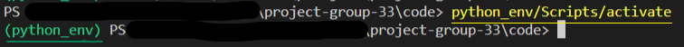
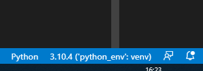

# Project group 33

**Members**:  
Daniel and Sang

## How to use...
0.  Activate Apache and MySQL in XAMPP.
    - Use http://localhost/phpmyadmin/ to access phpMyAdmin
1.  Download the SQL file and import it into phpMyAdmin.  
    - Here is the required database <a href = https://git.gvk.idi.ntnu.no/course/idatg2204/idatg2204-2022-workspace/sangnn/project-group-33/-/blob/main/data/ski_equipment_manufacturer.sql>SQL file </a>
2.  Download the project code (<a href = https://git.gvk.idi.ntnu.no/course/idatg2204/idatg2204-2022-workspace/sangnn/project-group-33/-/tree/main/code>these </a> are the different endpoints).  
3.  Run the environment script in VS Code and then run the different endpoints you want to test.  
    - Heres a <a href = https://docs.python.org/3/library/venv.html>link</a> in order to setup environment
    - check out **required modules**`⬇` for setting up the environment
4.  In Postman you can add a body (JSON-format) with extra information as the input for some of different functions (some functions does not require this).  
### Modules
**IMPORTANT** `⬇`

> Remember to **activate** your environment before installing the modules so that the environment gets the required modules 

> Remember to set the environment as the preferred python compiler f.ex. `3.10.4 (virt_env': venv)`
#### Required modules
- flask
- flask_mysqldb

##### Installing required modules
Use `pip install` and then the required module name
> for example: `pip install flask`

 
 
 

## Example of endpoints
> Testing these endpoints can be done by hitting the copy button next to the previewed code and pasting it onto the body section of postman 
> **!!** - remember that when copying the url any spaces after the url would likely lead to a **404** - Not found error.
#### Public 
METHOD:     **GET**  
URL:        http://127.0.0.1:5000/get_model  
>Output:     All available ski types will be retrieved (with optional model name filter).  

METHOD:     **GET** (*optional parameters*)  
URL:        http://127.0.0.1:5000/get_model  
            Body (raw, JSON):  

    {  
    "model": "active",  
    "length": "152"
    } 

>Output:     Retrieve all skis that have the model "active".  

#### Storekeeper
METHOD:     **GET**  
URL:        http://127.0.0.1:5000/get_available  
>Output:     Retrieve all skis that have the state "available".  

#### Customer
METHOD:     **GET**  
URL:        http://127.0.0.1:5000/get_orders  
            Body (raw, JSON): 

    {  
    "customerID": "1"
    } 
>Output:    Retrieves a list of orders a customer has made "1"   

METHOD:     **GET** (*optional parameters*)  
URL:        http://127.0.0.1:5000/get_orders  
            Body (raw, JSON): 
            
    { 
    "customerID": "2", 
    "since": "22-03-13"
    } 
>Output:    Retrieves a list of orders a customer has made (with an optional since filter)   

METHOD:     **GET**  
URL:        http://127.0.0.1:5000/get_plan_summary  
            Body (raw, JSON): 

    {  
    "startDate": "2022-06-10", 
    "endDate": "2022-08-29"  
    } 
>Output:     Get the production plans that are ongoing between the specified startDate and endDate  

METHOD:     **POST**  
URL:        http://127.0.0.1:5000/delete_order  
            Body (raw, JSON): 
            
    {  
    "orderNumber": "100"  
    } 
>Output:     Delete the order that has the order_number equal to 100.  

METHOD:     **PUT**  
URL:        http://127.0.0.1:5000/cancel_order  
            Body (raw, JSON): 
   
    {  
    "orderNumber": "200" 
    } 
>Output:     Change the state of an order with the "orderNumber" equal to 200 to "cancelled".  

#### Customer representative

METHOD:     **GET**  
URL:        http://127.0.0.1:5000/get_state   
            Body (raw, JSON): 
            
    {  
    "state": "new"  
    } 
>Output:     Retrieve a list of all orders with the state equal to "new".  

METHOD:     **PUT**  
URL:        http://127.0.0.1:5000/change_state_open  
            Body (raw, JSON): 

    {  
    "orderNumber": "1"
    } 
>Output:    Changes the "state" of an order from "new" to "open"

METHOD:     **PUT**  
URL:        http://127.0.0.1:5000/change_state_available  
            Body (raw, JSON): 

    {  
    "orderNumber": "1"
    } 
>Output:    Changes the "state" of an order from "open" to "available"

METHOD:     **POST**  
URL:        http://127.0.0.1:5000/fill_order  
            Body (raw, JSON): 

    {
    "transporterID": "2",
    "orderNumber": "3",
    "shippingAddress": "Bokveien 5",
    "pickUpDate": "29-04-2022"
    }
>Output:    Fills an order and creates a shipment request for a shipment
